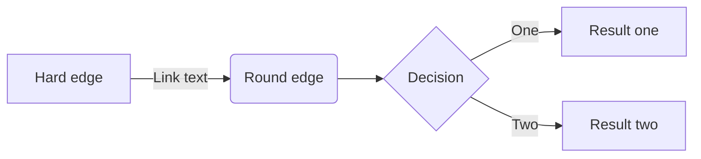

# User Guide

## High-level Architecture

> TODO: Add a diagram and describe the data flow between systems.



## Background

The vocabularies in this repository are encoded in [RDF Turtle](https://www.w3.org/TR/turtle/) using the [SKOS](https://www.w3.org/TR/skos-reference/). Each vocabulary is stored in its own `.ttl` file in the [vocabularies](./vocabularies) directory and each vocabulary file conforms to the [VocPub Profile](https://w3id.org/profile/vocpub).

The VocPub Profile is maintained and published by the [Australian Government Linked Data Working Group (AGLDWG)](https://www.linked.data.gov.au/) and provides an opinionated set of best practices for structuring and publishing SKOS vocabularies.
It is expected that all vocabularies that are created or modified in this repository to conform to the VocPub Profile. Conformance validation is implemented as DevOps pipelines that are triggered when the repository is updated.

For all of the VocPub rules, see the [VocPub Specification](https://w3id.org/profile/vocpub/spec).

For the technical validator implemented in [SHACL](https://www.w3.org/TR/shacl/), see the [VocPub Validator](https://w3id.org/profile/vocpub/validator).

This repository can be edited by anyone with the correct permissions to do so but it is expected that all changes are made on a separate branch and then submitted as a pull request for review. Best practice is to create a new branch per user per vocabulary. For example, if John was making a change to the [vocabularies/for-codes.ttl](./vocabularies/for-codes.ttl), a suitable branch name would be `john/for-codes`. Once John has finished making his changes, he would submit a pull request to merge his branch back into the `main` branch. On pull request creation or updates, a "Vocab validation" pipeline will automatically trigger and validate the changes. The pull request can only be merged if the validation finds no errors.

> Maintainers may want to lock down the `main` branch to prevent direct pushes. This will enforce the use of pull requests for all changes.

> Maintainers may want to implement the rule that a pull request can only be merged if a required reviewer approves.

On a pull request merge to the `main` branch, another pipeline will automatically trigger to publish the new changes to the `vocabs-dev` environment. The new vocabulary changes are pushed to the Fuseki database and downstream applications such as VocPrez and CKAN will automatically pick up the new changes.

Deployments to `vocabs-uat` and `vocabs-prod` require manual approvals from one or more approvers. Once approved, the new vocabulary content is pushed to the environment as described in the `vocabs-dev` environment scenario.

## Merge Conflicts

If multiple users edit the same file at the same time, [merge conflicts](https://learn.microsoft.com/en-us/azure/devops/repos/git/merging?view=azure-devops&tabs=visual-studio-2022) may occur. You can either resolve the merge conflict in Azure Repo or resolve it in your local branch and then push your changes back to the repository. The latter is the preferred method as there are useful tooling such as [Visual Studio Code](https://code.visualstudio.com/) to help with resolving merge conflicts.

See [Git merge conflicts](https://www.atlassian.com/git/tutorials/using-branches/merge-conflicts) for more information.

## Creating and Updating a Vocabulary

### Git Clone and Branch

First step is to always create a new branch for your changes. If you haven't done so already, clone the repository and create a new branch.

In your terminal, run the following command to clone the repository:

```sh
git clone https://DEMSA@dev.azure.com/DEMSA/MESAC/_git/vocabs
```

Note, you may be prompted for the password. If you have the appropriate permissions to the repository, you will be able to generate git credentials via the web user-interface of the repository.

Once the repository has been cloned, create a new branch for your changes.

```sh
git checkout -b john/rock-types
```

### Vocabulary File

Before creating a new vocabulary, first decide what the vocabulary is called and then determine what the IRI namespace of the vocabulary will be.

For example, for a new "Rock Types" vocabulary, create a new file under [vocabularies](./vocabularies) called `rock-types.ttl` and give it a namespace of `http://linked.data.gov.au/def/mer-rock-types`.

In `rock-types.ttl`, first declare the prefixes that will be used in the vocabulary:

```turtle
PREFIX : <https://linked.data.gov.au/def/mer-rock-types/>
PREFIX astatus: <https://linked.data.gov.au/def/reg-statuses/>
PREFIX cs: <https://linked.data.gov.au/def/mer-rock-types>
PREFIX rdfs: <http://www.w3.org/2000/01/rdf-schema#>
PREFIX reg: <http://purl.org/linked-data/registry#>
PREFIX schema: <https://schema.org/>
PREFIX skos: <http://www.w3.org/2004/02/skos/core#>
PREFIX xsd: <http://www.w3.org/2001/XMLSchema#>
```

Notice that most of the prefix namespaces are the same as what's defined in other vocabularies except for the `:` and `cs:` prefixes. The `cs:` is a shortform for the vocabulary's IRI and the `:` is a shortform for all of the resources such as concepts that will fall under this vocabulary.

> Notice the trailing slash in the `:` prefix and the lack of a trailing slash in the `cs:` prefix.

Next, declare the vocabulary as a SKOS vocabulary:

```turtle
cs:
    a skos:ConceptScheme ;
    reg:status astatus:stable ;
    skos:definition "MER's rock types"@en ;
    skos:prefLabel "MER Rock Types"@en ;
    schema:creator <https://linked.data.gov.au/org/mer> ;
    schema:dateCreated "2025-02-25"^^xsd:date ;
    schema:dateModified "2025-02-25"^^xsd:date ;
    schema:issued "2025-02-25"^^xsd:date ;
    schema:license <https://purl.org/NET/rdflicense/cc-by4.0> ;
    schema:publisher <https://linked.data.gov.au/org/mer> ;
    schema:rights "© Department for Energy and Mining, 2025"@en ;
.
```

Now, add the concepts that will fall under this vocabulary. For example, we add Basalt, a top concept of the vocabulary.

> TODO: Add diagram with concept scheme and concept.

```turtle
:basalt
    a skos:Concept ;
    reg:status astatus:stable ;
    rdfs:isDefinedBy cs: ;
    skos:definition "A description of basalt"@en ;
    skos:inScheme cs: ;
    skos:prefLabel "Basalt"@en ;
    skos:topConceptOf cs: ;
.
```

It is important to remember to add the directional relationships from the concept scheme to the concept when creating new concepts. For example, here we've added `:basalt` as a top concept, but we also need to specify that the concept scheme has basalt as a top concept. In the next step, we'll define `:basalt` as a top concept of the concept scheme.

```turtle
cs: skos:hasTopConcept :basalt .
```

> TODO: Add diagram with concept scheme and concept in the other direction.

Next, we will create a new concept that is a narrower and more specific version of basalt. We call this concept Alkali basalt. Notice that we specify that the concept has a `skos:broader` relationship to the `:basalt` concept.

```turtle
:alkali-basalt
    a skos:Concept ;
    reg:status astatus:stable ;
    rdfs:isDefinedBy cs: ;
    skos:definition "A description of alkali basalt"@en ;
    skos:inScheme cs: ;
    skos:prefLabel "Alkali basalt"@en ;
    skos:broader :basalt ;
.
```

Likewise, we want to specify that the `:basalt` concept has an `skos:narrower` relationship to the `:alkali-basalt` concept.

> TODO: Add diagram with concept scheme and concept in the other direction.

```turtle
:basalt skos:narrower :alkali-basalt .
```

> TODO: Add diagram with concept scheme and concept in the other direction.

And that's all there is to creating and updating SKOS vocabularies. As long as the expected metadata properties exist, the vocabulary will be valid and conform to the VocPub Profile. But don't worry, if you forget to add a property, the validator will let you know.

### Pull Request

> TODO: Add flow diagram

> TODO: Add screenshots of where to create a pull request.

Once you have made your changes, you can create a pull request to merge your changes back into the `main` branch.

```sh
git push origin john/rock-types
```

Now that the branch has been pushed to the repository, you can create a pull request to merge your changes back into the `main` branch. Go to the web user-interface of the repository and [create a new pull request](https://dev.azure.com/DEMSA/MESAC/_git/vocabs/pullrequests?_a=mine).

Select the source branch `john/rock-types` and the target branch `main`. Supply a suitable title and description for the pull request and then click the "Create" button to create the pull request. Here, you can choose to add reviewers to the pull request to prompt them to review your changes.

Once the pull request has been created, a "Vocab validation" pipeline will automatically trigger and validate the changes. The pull request can only be merged if the validation finds no errors.

If the "Vocab validation" pipeline finds errors, you can update the pull request by pushing more changes to the branch `john/rock-types`. The "Vocab validation" pipeline will automatically trigger again and validate the changes.

### Merge

Once the pull request has been approved, you can merge the pull request into the `main` branch.

### Deploy to DEV

Once the pull request has been merged into the `main` branch, a `vocabs-dev-deploy` pipeline will automatically trigger to deploy the new changes to the `vocabs-dev` environment.

### Deploy to UAT

> TODO: Add screenshots of where to approve the deployment of pipelines for both UAT and PROD.

At any time, you can manually trigger a `vocabs-uat-deploy` pipeline to deploy the new changes to the `vocabs-uat` environment.

### Deploy to PROD

At any time, you can manually trigger a `vocabs-prod-deploy` pipeline to deploy the new changes to the `vocabs-prod` environment.
